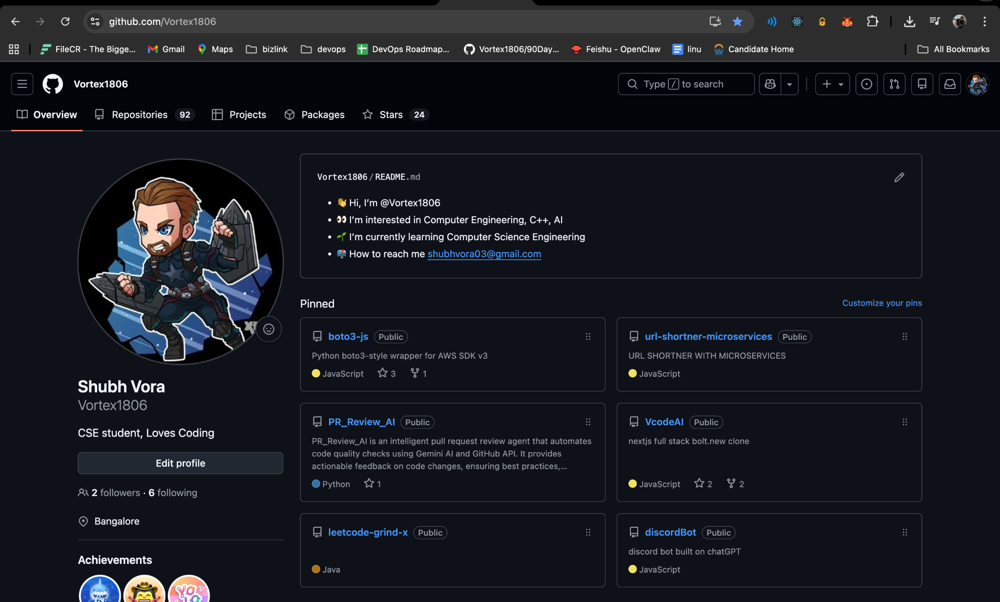
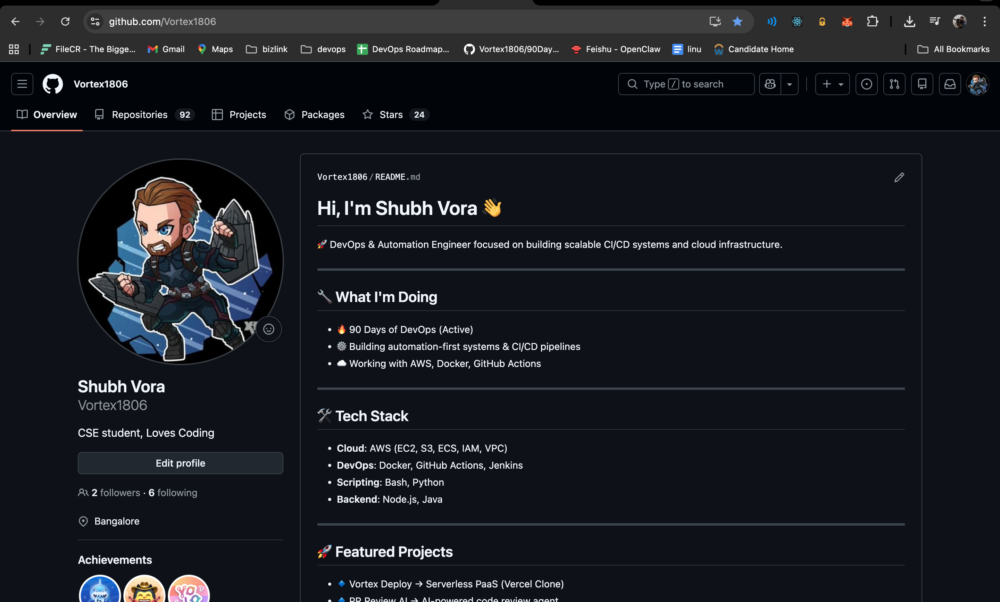

# Day 27 – GitHub Profile Makeover

## Before

- Profile lacked clear DevOps identity
- Random repositories pinned
- No structured learning repositories
- Some repos missing README and descriptions
  

## Changes Made

### Profile README

- Created a clean DevOps-focused README
- Highlighted current work (90 Days of DevOps)
- Showcased key projects

### Repository Organization

- Created:
  - 90-days-of-devops
  - devops-notes
  - shell-scripts
  - python-scripts

### Cleanup

- Removed irrelevant repositories
- Renamed unclear repositories
- Added descriptions and READMEs
  

### Pinned Repositories

- Selected 6 relevant projects aligned with DevOps

## Improvements

1. Clear Developer Identity  
   → Now positioned as a DevOps Engineer instead of general coder

2. Structured Learning  
   → Organized repositories show consistency and discipline

3. Professional Presentation  
   → Clean README and curated projects improve recruiter perception
